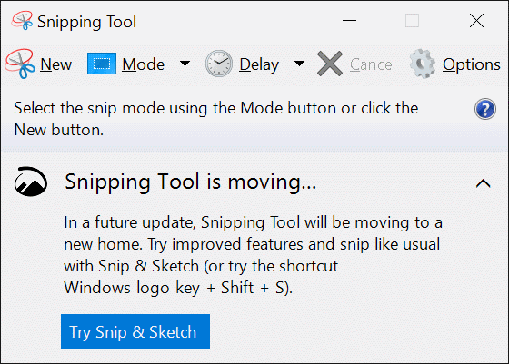
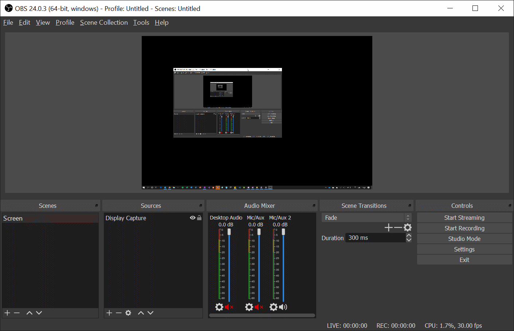
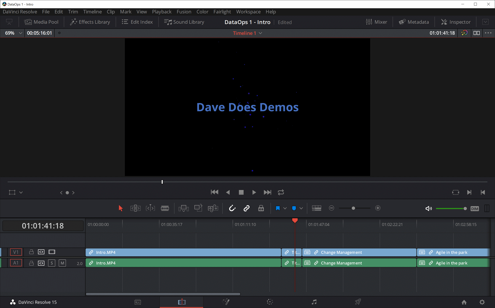
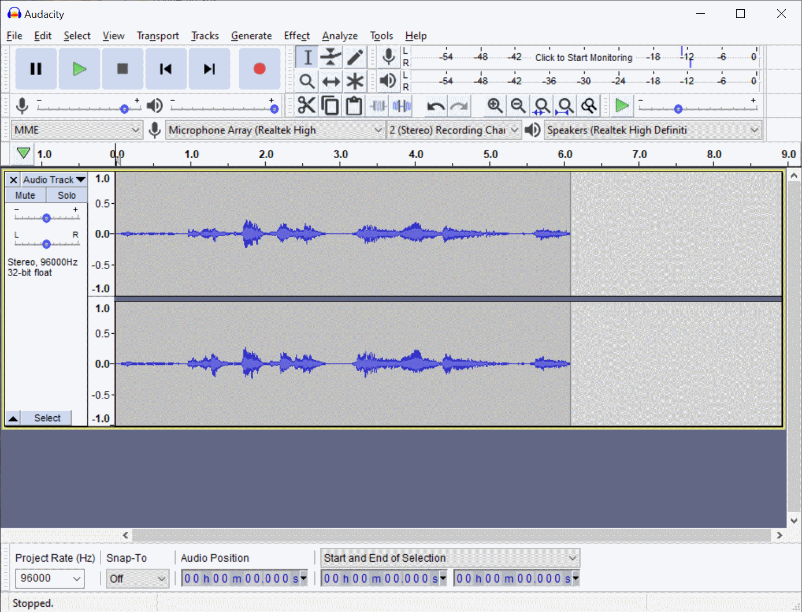

# How I Record Demos

**produced by Dave Lusty**

## Introduction
This page holds details of how I make videos of the demos in the various repositories of Dave Does Demos. This isn't a general guide to video making, just an explanation of the various things I do in case they are useful to colleagues, friends and fans.

### Process
The process of making the video can be split into the following areas:

* Writing the demo
* Writing the video script
* Recording the technical demo on screen
* Recording the Intro and other interview/monologue style footage
* Editing the video footage
* Recording the audio track(s)
* Editing in the audio track
* Collecting B-Roll

## Writing the demo

When writing demos for the collection I generally try to make them an example of some real world activity, rather than just showing off a feature of a product. This means that the viewer will be able to relate to using that functionality and will be better able to use the knowledge on their own environment. As far as possible I also try to make the demo end to end for the task, including any complexity rather than skipping it. On very long demos I may skip some parts, but generally things like real world security should be included since demos that say "in the real world you'd do it differently" are far less useful.
The demos start as a public repository on GitHub, and are written in markdown to ensure they are easy to access directly on Github through a link to the page. To write this I use Visual Studio Code which will format markdown nicely and has an available rules engine to ensure good structure of the page. The pages are designed to be self contained and so contain any and all knowledge or links to cover the demo itself, ideally with scripts, code and deployment automation built in. Code is always marked as such so that it displays properly and is formatted with the correct language keywords highlighted. Deployment automation is generally a button which pushes an Azure ARM template to Azure. This allows viewers to save time in deploying the base environment but rarely contains any configuration beyond that. Where usernames and passwords are needed I specify demogod and Password123$ which generally work with everything on Azure and are easy to remember. Security is not a consideration for demo environments so while the environment is configured correctly and securely, credentials are less of a concern.
Images are included to show the interface at avery step, but I try not to add to many as it breaks up the content. For these I use the excelent Windows Snipping tool. 

Structure of the repo is generally simple, with something like the following:

_instructions.md <- an MD file with the instructions

|_images <- all images stored here to keep the repo tidy

|_infrastructure <- This is where I store the ARM template

|_code <-source code goes in here. It must be cleaned before commit up to the repo.

|_scripts <- sometimes I have scripts instead of code

Each demo lives in its own repository. I get a LOT of feedback asking for a single repository, but really it's simpler for people to clone the one they're working on. Cloning everything would necessitate copying huge amounts of data which may go unused. For this reason, I also have the index repo where aka.ms/davedoesdemos points. This allows people to discover and link content for convenience. The index has a table of demos and links to videos etc. and may be extended in future with multiple pages if the site grows too large to easily find things.

## Writing the video script

This is fairly new to the site. I use OneNote to create a script and shot list to ensure everything is planned. The script (used for monologue) is written as bullet points in large font. I then use a Surface tablet on a music stand to hold this just under the lens of the camera so I can glance at it while recording.
The script will always include three sections

* Introduction - A welcome to the site and explanation of what the video will contain as well as why it's needed.
* Demo - The actual demo, generally with screen based video and audio dubbed over later
* Wrap up - Thank the audience, tell them to subscribe and hit like, share the video, whats coming next, upcoming events

## Recording the Technical Demo on Screen

For screen recording, I use the excellent open source and free [OBS Studio](https://obsproject.com/). This allows all kinds of complex scenarios for recording. There are some gotchas when using a detachable laptop with multiple GPUs - these are fixed with the NVIDIA control panel by fixing OBS to the onboard GPU. I generally record screens at 1080p30 which gives high quality while also offering good performance. This resolution also renders well in Windows, with on screen menus being a resonable size by default for the resolution (I use 125% scaling). It also gives a good amount of screen real estate and shows well on YouTube. In some scenarios you may want to zoom in your application or increase the scale to make things more clear. Remember though you can also dynamically zoom later in the edit to highlight a screen area.

When setting up to screen record, do the following:
* Hide desktop items (right click on the desktop, View)
* Black/plain background (Right click desktop, Personalize)
* 1080 resolution (Right click desktop, Display Settings)
* Close email and Teams etc. so that personal messages do not appear
* Use a different browser and private browsing tab so that personal browsing doesn't show in searches etc. or favourites on the toolbar
* Close all tabs

In an ideal world, create a blank user account for only this purpose so that it's always ready to go and doesn't have day to day clutter.

While recording, do the following:

* Keep the mouse cursor still unless actively doing something - this makes editing easier
* Hover over buttons and links breifly before clicking to allow time for narration to explain the button and to ensure people see where you click
* Move the mouse very slowly
* Type slowly and try not to make mistakes
* Record instructions in scenes. It's very hard to do everything in one take without errors

## Recording the Intro and other interview/monologue style footage

Recording methods can vary dramatically depending on available equipment and so some research is recommended here. A simple GoPro or phone will work fine; adding a tripod will improve things.

### Person

Before starting any recording it's important to set up for the shot and make yourself presentable:

* Iron shirt/clothes - choose your style and implement it well. If you tuck in a shirt check that it's tucked. If you wear a shirt iron it. If you wear a t-shirt make sure it's not offensive.
* check mirror or take a sample shot
* brush/style hair

### Location

Before starting recording, set up the shot

* remove clutter
* have interesting things in view
* choose a suitable background if available
* if there is back lighting, balance it with front lighting

### Lighting

Shoot in a well lit room, preferably with sunlight. Ensure your camera is set to the correct white balance for each and every shot.
Place a bright but soft light like a softbox in front and to the side of the subject.
Ideally place a harder light to shine on their face too.

### Camera

Wide angles work well for this style of footage, so wide mode on GoPro or a wide angle lens on SLR. I use an 11-24mm lens with SLR APS-C sensor which works well.
Clean your lens
Check the storage capacity
Use a tripod unless you want a VLog style dynamic shot speaking to camera.

I use a tripod for the camera and an HDMI cable to connect to an external monitor so I can see myself for simpler shot setup. The external monitor also allows me to see my sound levels at a glance.

I use 1080p24 or 1080p30 for video. I can recod 4k with all of my cameras but honestly this just makes the files larger and the editing and encoding slower.

For editing reasons ALL clips should start and end with a count to 5. Ideally also count to 3 between sentences since fast talking makes editing and cutting harder.

Look at the lens not at the screen/floor/ceiling. The lens is where your viewers eye will be when they watch so look directly at them.

### Sound

I use lavalier mics in almost all scenarios. These can connect to a sound recording app on a phone in my pocket, to the camera, or to a PC mic input. The sound is great as they are next to my mouth.
When recording indoors using the SLR I will use a Rode Video Micro for convenience to avoid setup of the lav mic. This will either be mounted on the camera hotshoe or on a Gorrillapod as close to my mouth as possible without being in shot. This produces great sound and is more convenient than the Lav mic setup which needs to be clipped to clothing.

I check levels by speaking (say something like "welcome to the channel") and aiming for good peaks without clipping.

When using a GoPro or drone, I will record audio on the camera but also put a phone/recorder in my pocket with a hidden lav mic. I then sync these using a simple clap, which is visible on the screen as well as producing a nice high peak on the audio to see. Prior to this I leave several seconds of silence which also helps to identify the start of a scene.

## Editing the Video Footage

For editing I use the excellent [DaVinci Resolve](https://www.blackmagicdesign.com/uk/products/davinciresolve/). Somehow this software has an almost complete version available for free and is available for Windows, Linux and Mac systems. This product is used commercially on large movies and so is very capable, as well as having a wealth of information on YouTube to learn how to use it, making it extremely accessible.

* watermark
* import clips
* cut beginning and end
* speed up/remove slow parts

## Sound Recording

There are two scenarios for sound recording, firstly while shooting video and secondly while narrating a video.

### While filming

While filming I will let the camera record audio and will always use a separate mic to record a high quality version. For lavalier mics I will usually use the voice memo app on my phone to capture the audio.

### Narrating

While narrating I work in my quiet office at home and connect a good microphone to the computer. This will either be a lavalier mic or a Rode Video Micro. If using the Rode I set it up on a Gorillapod on my desk directly in front of me, the lavalier will be set up on my shirt as normal. I use [Audacity](audacityteam.org/) to record the audio as it shows levels on screen.

When recording I watch the video and describe what's happening. As with the screen recording, I do this in scenes to reduce mistakes. Leave a pause between sentences for editing and speak slowly and clearly. Any coughs or other noises can potentially be edited out but I generally just re-record as it doesn't take too long.

### Other Equipment
[Mavic Air](https://www.dji.com/uk/mavic* air)
[Lav Mic]()
[Camera Mic]()

